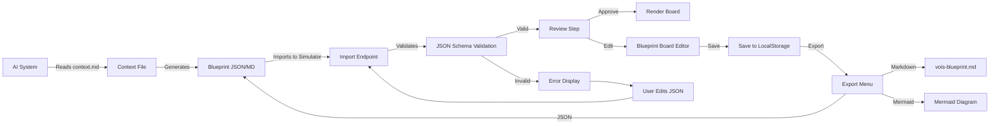

# Import AI Blueprint Flow — Design Document

## Overview

An external AI system (or human) produces a VOIS blueprint using the context file, JSON schema,
and blueprint format. The simulator provides an import interface to load these blueprints,
validate them, allow visual editing, and save/export them.

## Flow



## Steps

### 1. AI Generates a Blueprint

An AI system reads the Vaulted Ventures context file (`context.md`) plus the user's business
context, then generates a valid `vois-blueprint.json` conforming to the schema at
`schemas/vois-blueprint.json` and/or a `vois-blueprint.md` conforming to
`formats/vois-blueprint.md`.

**Prompt template** (designed to be used by AI assistants):

> You have loaded the Vaulted Ventures AI context. Understand the Vaulted Objects
> Infrastructure primitives and preferred terminology.
>
> Given the following business context: [USER CONTEXT]
>
> Generate a VOIS blueprint in native JSON format conforming to the schema. Identify:
> - Actors, agents, and systems involved
> - Digital objects and vaulted objects
> - Authorities and their seal types
> - Provenance events (creation, sealing, verification, transfer)
> - Controls and governance rules
> - Proofs and evidence
> - Risks and failure modes
> - Open questions for implementation
>
> Output as valid `vois-blueprint.json`.

### 2. Import Entry Points

The simulator provides **two import entry points**:

| Method | UI Action | Technical |
|--------|-----------|-----------|
| **Upload File** | Click "Import Blueprint" → Select JSON or MD file using browser file picker | FileReader API on the frontend, validates client-side against JSON Schema |
| **Paste** | Click "Import Blueprint" → Paste JSON or Markdown into a text area | Direct string validation, same schema check |
| **URL Import** (future) | Paste a URL to a blueprint (GitHub raw URL, etc.) | Fetch + validate |
| **AI Prompt** (future) | Type natural language → Agent generates blueprint inline | Delegates to backend AI endpoint with context file as system prompt |

### 3. Validation

Before anything is rendered, validation runs client-side:

1. **Parse check** — valid JSON? If Markdown, extract YAML frontmatter and parse.
2. **Schema validation** — check against `schemas/vois-blueprint.json` JSON Schema (Draft-07).
   Validates: required fields, enum values, reference integrity (no dangling refs), data types.
3. **Integrity check** — all `EntityRef.ref` values point to existing entities in the
   blueprint. All edge source/target IDs reference existing nodes.
4. **Terminology check** — warn if the blueprint uses discouraged terms (PQC, blockchain,
   quantum-safe, etc.) in descriptions.

**Validation result display:**

```
✅ Blueprint validates successfully
   - 4 actors, 3 agents, 6 objects, 3 authorities
   - 7 events, 5 controls, 6 proofs
   - 4 open questions
```

```
❌ Validation errors (3):
   - Edge e-001: source "n-999" does not match any node ID
   - Object obj-003: "is_vaulted" must be boolean
   - Event evt-005: missing required field "actor"
```

### 4. Review Step

After validation, the user sees a **review summary page** showing:

- Blueprint name, industry, scenario
- Entity counts per type (actors, agents, objects, etc.)
- A read-only preview of the board layout (if nodes/edges are present)
- An embedded Mermaid diagram (if node data exists)
- The list of open questions
- Terminology warnings (non-blocking)

**Actions:** Approve, Edit Raw JSON, Discard

### 5. Board Rendering

When approved, the blueprint's `nodes` and `edges` render on the blueprint board using the
simulator's React Flow canvas. Each node type maps to a visual style:

| Node Type | Visual Style |
|-----------|-------------|
| actor/agent | Person/shape icon |
| object | Document/box icon |
| authority | Shield/badge icon |
| event | Circle/process icon |
| control | Diamond/gate icon |
| proof | Certificate/seal icon |

Entities not yet placed on the board appear in a **palette drawer** — the user drags them onto
the canvas to add them.

### 6. Save & Export

After import and editing, the user can:

- **Save to LocalStorage** — persists in-browser (v1 behaviour)
- **Export as JSON** — downloads `vois-blueprint.json`
- **Export as Markdown** — downloads `vois-blueprint.md`
- **Export as Mermaid** — downloads just the `.mmd` file
- **Export as SVG** — renders the board as an SVG image

### 7. Implementation Notes

**Frontend-only for v1.** All validation and rendering happens client-side. No backend
required beyond serving the static assets.

**Dependencies to add:**
- `ajv` or `@cfworker/json-schema` — JSON Schema validation (lightweight, tree-shakeable)
- Optional: `js-yaml` for Markdown frontmatter parsing

**Code sketch (React):**

```tsx
// BlueprintImport.tsx
function BlueprintImport() {
  const [raw, setRaw] = useState('');
  const [errors, setErrors] = useState<ValidationError[]>([]);
  const [blueprint, setBlueprint] = useState<VOISBlueprint | null>(null);

  const handleImport = (text: string) => {
    const parsed = tryParse(text);
    if (!parsed) { setErrors([{message:'Invalid JSON'}]); return; }
    const schema = await fetchSchema();
    const valid = ajv.validate(schema, parsed);
    if (!valid) { setErrors(ajv.errors); return; }
    setBlueprint(parsed);
  };
}
```

**Data flow:**
- Import → Parse → Validate → Review → Accept → Store in app state
- The blueprint board reads from app state, not directly from the import
- Editor changes update the blueprint object, triggering re-render

## Open Questions

| Question | Status |
|----------|--------|
| Should Markdown frontmatter support be built in v1 or v2? | v1 — both JSON and MD from day 1 |
| Should we support drag-and-drop file upload? | Yes, it's standard browser UX |
| Should imports include an "example" dropdown pre-loaded with sample blueprints? | Yes, for demo/onboarding |
| Should partial imports be supported (e.g. only actors and events, no board layout)? | Yes, palette drawer handles this |

---

*Designed for the Vaulted Objects Infrastructure Simulator*
*Part of the Agent Context project*
