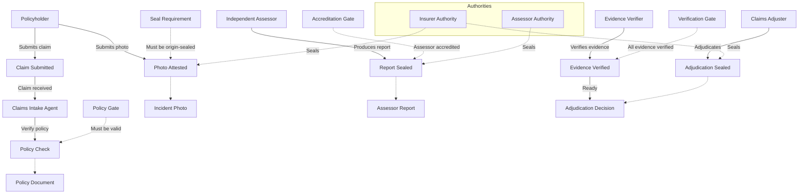

# Blueprint: Insurance Claim Evidence Workflow

## Purpose

Model the lifecycle of a digital insurance claim — from policyholder submission through
evidence collection, ITS sealing, authority verification, and final adjudication. Demonstrates
how Vaulted Objects Infrastructure primitives apply to a standard insurance workflow.

## Industry Context

Insurance claims processing involves multiple actors (policyholder, adjuster, assessor,
regulator) and requires verifiable provenance for submitted evidence. Current systems rely on
PKI signatures and centralised databases. This blueprint shows the Zero-Exposure ITS
alternative.

---

## Actors

| ID | Name | Type | Trust Boundary |
|----|------|------|----------------|
| act-001 | Policyholder | human | External — claimant |
| act-002 | Claims Adjuster | human | Internal — insurer |
| act-003 | Independent Assessor | organisation | External — accredited |
| act-004 | Regulator | organisation | External — supervisory |

## Agents

| ID | Name | Type | Delegated By | Capabilities |
|----|------|------|-------------|--------------|
| agt-001 | Claims Intake Agent | ai_agent | act-002 | Receive claim, verify policy, route to adjuster |
| agt-002 | Evidence Verification Agent | ai_agent | act-003 | Check seal integrity, verify provenance chain |
| agt-003 | Compliance Monitoring Agent | ai_agent | act-004 | Audit claim lifecycle, generate regulatory reports |

## Digital Objects

| ID | Name | Type | Vaulted | Possessed By | Lifecycle State |
|----|------|------|---------|--------------|-----------------|
| obj-001 | Claim Submission | document | No | act-001 | Submitted |
| obj-002 | Policy Document | vaulted_object | Yes | act-002 | Active |
| obj-003 | Incident Photo | evidence | Yes | act-001 | Sealed |
| obj-004 | Assessor Report | vaulted_object | Yes | act-003 | Sealed |
| obj-005 | Adjudication Decision | vaulted_object | Yes | act-002 | Finalised |
| obj-006 | Audit Record | record | Yes | act-004 | Active |

## Authorities

| ID | Name | Type | Seal Types | Verification Method |
|----|------|------|------------|-------------------|
| auth-001 | Insurer Authority | certifying_authority | origin_seal, authority_seal, attestation | Possession proof + seal chain |
| auth-002 | Accredited Assessor Authority | trusted_third_party | attestation, integrity_seal | Multi-party verification |
| auth-003 | Industry Regulator | regulatory_body | authority_seal | Hierarchical trust chain |

## Provenance & Events

| ID | Type | Name | Actor | Object | Authority | Evidence |
|----|------|------|-------|--------|-----------|----------|
| evt-001 | creation | Claim Submitted | act-001 | obj-001 | — | — |
| evt-002 | verification | Policy Check | agt-001 | obj-002 | auth-001 | prf-001 |
| evt-003 | verification | Incident Photo Attested | act-001 | obj-003 | auth-001 | prf-002 |
| evt-004 | sealing | Assessor Report Sealed | act-003 | obj-004 | auth-002 | prf-003 |
| evt-005 | verification | Evidence Chain Verified | agt-002 | obj-003, obj-004 | auth-002 | prf-004 |
| evt-006 | sealing | Adjudication Sealed | act-002 | obj-005 | auth-001 | prf-005 |
| evt-007 | audit | Regulatory Audit | agt-003 | obj-006 | auth-003 | prf-006 |

## Controls & Governance

| ID | Name | Type | Controlled By | Governance Rules |
|----|------|------|---------------|-----------------|
| ctl-001 | Policy Valid Before Processing | verification_check | auth-001 | Claim must match active policy |
| ctl-002 | Evidence Must Be Sealed | seal_requirement | auth-001 | All evidence must carry origin seal |
| ctl-003 | Assessor Must Be Accredited | approval_gate | auth-002 | Only accredited assessors seal reports |
| ctl-004 | Adjudication Requires Verification | verification_check | auth-001 | Verify all evidence chains before seal |
| ctl-005 | Mandatory Regulatory Copy | policy_enforcement | auth-003 | Audit record must be generated per claim |

## Proofs & Evidence

| ID | Type | Name | Produced By | Consumed By |
|----|------|------|-------------|-------------|
| prf-001 | verification_record | Policy Verification Proof | evt-002 | evt-005 |
| prf-002 | digital_seal | Photo Origin Seal | evt-003 | evt-005 |
| prf-003 | its_signature | Assessor Report ITS Signature | evt-004 | evt-005 |
| prf-004 | verification_record | Evidence Chain Verification | evt-005 | evt-006 |
| prf-005 | digital_seal | Adjudication Seal | evt-006 | — |
| prf-006 | audit_log | Compliance Audit Record | evt-007 | — |

## Workflow

1. **Policyholder submits a claim** (obj-001) via the claims portal. The Claims Intake Agent
   (agt-001) receives it.
2. **Policy is verified** (ctl-001). agt-001 checks the Policy Document (obj-002) against the
   claim. If valid, a Policy Verification Proof (prf-001) is generated.
3. **Evidence is collected and sealed**. The policyholder submits an Incident Photo (obj-003)
   which receives a Photo Origin Seal (prf-002) from the Insurer Authority (auth-001).
4. **Independent assessment**. An accredited assessor (act-003) produces the Assessor Report
   (obj-004), sealed with an ITS signature (prf-003) from the Accredited Assessor Authority
   (auth-002).
5. **Evidence chain is verified**. The Evidence Verification Agent (agt-002) checks all seals,
   provenance, and the policy verification. Produces an Evidence Chain Verification (prf-004).
6. **Adjudication**. The Claims Adjuster (act-002) reviews the verified evidence, and the
   Adjudication Decision (obj-005) receives the Adjudication Seal (prf-005) from auth-001.
7. **Regulatory compliance**. The Compliance Monitoring Agent (agt-003) generates an audit
   record (obj-006) with a Compliance Audit Record (prf-006) for the regulator (act-004).

## Simulator Nodes

| Node ID | Type | Maps To | Label |
|---------|------|---------|-------|
| n-001 | actor | act-001 | Policyholder |
| n-002 | actor | act-002 | Claims Adjuster |
| n-003 | actor | act-003 | Independent Assessor |
| n-004 | actor | act-004 | Regulator |
| n-005 | agent | agt-001 | Claims Intake Agent |
| n-006 | agent | agt-002 | Evidence Verifier |
| n-007 | agent | agt-003 | Compliance Monitor |
| n-008 | object | obj-001 | Claim Submission |
| n-009 | object | obj-002 | Policy Document |
| n-010 | object | obj-003 | Incident Photo |
| n-011 | object | obj-004 | Assessor Report |
| n-012 | object | obj-005 | Adjudication Decision |
| n-013 | event | evt-001 | Claim Submitted |
| n-014 | event | evt-002 | Policy Check |
| n-015 | event | evt-003 | Photo Attested |
| n-016 | event | evt-004 | Report Sealed |
| n-017 | event | evt-005 | Evidence Verified |
| n-018 | event | evt-006 | Adjudication Sealed |
| n-019 | control | ctl-001 | Policy Gate |
| n-020 | control | ctl-002 | Seal Requirement |
| n-021 | control | ctl-003 | Accreditation Gate |
| n-022 | control | ctl-004 | Verification Gate |
| n-023 | authority | auth-001 | Insurer Authority |
| n-024 | authority | auth-002 | Assessor Authority |
| n-025 | authority | auth-003 | Regulator |

## Simulator Edges

| Edge ID | Source | Target | Type | Label |
|---------|--------|--------|------|-------|
| e-001 | n-001 | n-013 | flow | Submits claim |
| e-002 | n-013 | n-005 | flow | Claim received |
| e-003 | n-005 | n-014 | flow | Verify policy |
| e-004 | n-019 | n-014 | control | Policy must be valid |
| e-005 | n-014 | n-009 | data_flow | References policy |
| e-006 | n-001 | n-015 | flow | Submits photo |
| e-007 | n-020 | n-015 | control | Must be origin-sealed |
| e-008 | n-015 | n-010 | data_flow | Seals photo |
| e-009 | n-003 | n-016 | flow | Produces report |
| e-010 | n-021 | n-016 | control | Assessor accredited |
| e-011 | n-016 | n-011 | data_flow | Seals report |
| e-012 | n-006 | n-017 | flow | Verifies evidence |
| e-013 | n-022 | n-017 | control | All evidence verified |
| e-014 | n-017 | n-012 | flow | Ready for adjudication |
| e-015 | n-002 | n-018 | flow | Adjudicates |
| e-016 | n-018 | n-012 | data_flow | Seals decision |

## Risks & Failure Modes

| Risk | Severity | Affected Entities | Mitigation |
|------|----------|-------------------|------------|
| Policyholder submits forged photo | high | obj-003, evt-003 | Origin seal at capture time with tamper-evident metadata |
| Unaccredited assessor seals report | critical | act-003, obj-004, ctl-003 | Accreditation gate blocks unverified assessors |
| Seal chain verification failure | high | evt-005, obj-004 | Evidence Verifier produces detailed failure report for manual review |
| Regulatory audit finds gap | medium | obj-006, evt-007 | Compliance Monitor runs continuously, not batch |
| Policy expired but claim processed | high | obj-002, ctl-001 | Policy check runs at claim submission time + peak adjudication time |

## Open Questions

| Question | Context | Status |
|----------|---------|--------|
| Should photo sealing happen client-side or server-side? | Impacts trust model for mobile claims | open |
| How does the regulator verify without holding the keys? | Zero-Exposure verification model needs explanation | resolved — possession proof protocol |
| What happens when an assessor authority is revoked? | Accreditation gate needs revocation list | open |
| Should the blueprint include subrogation (insurer vs insurer)? | Extends model to multi-party recovery | deferred |

## Export Mappings

| Format | Status | Notes |
|--------|--------|-------|
| BPMN 2.0 | not_started | Swimlanes per trust boundary, lanes per actor |
| JSON-LD | not_started | Semantic context for Vaulted Objects primitives |
| Mermaid | complete | Embedded flowchart above |
| OSCAL | not_started | Control mappings for regulated compliance |
| W3C PROV | not_started | Entity → Activity → Agent mapping exists in schema |
| C4 | not_started | System context + container views for the insurance IT landscape |

---

*Generated by the Vaulted Objects Infrastructure Simulator*
*Native format: `vois-blueprint.md`*
*JSON export: `vois-blueprint.json`*
